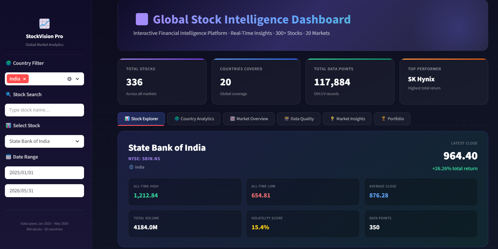
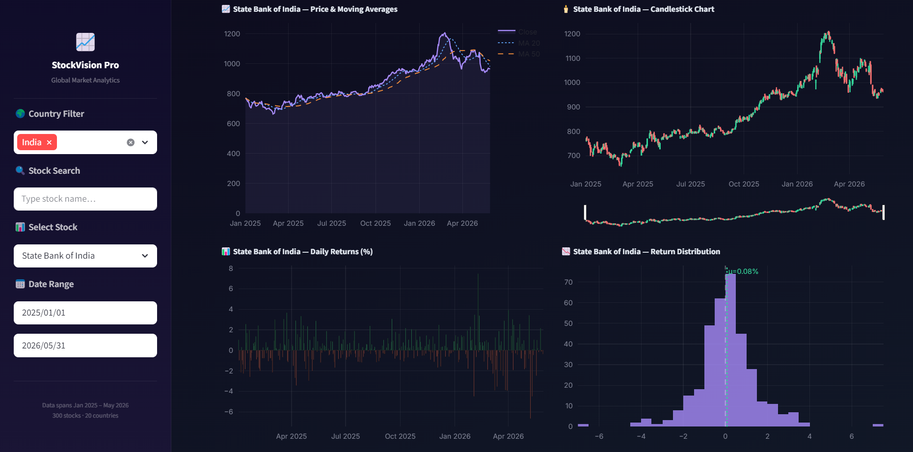
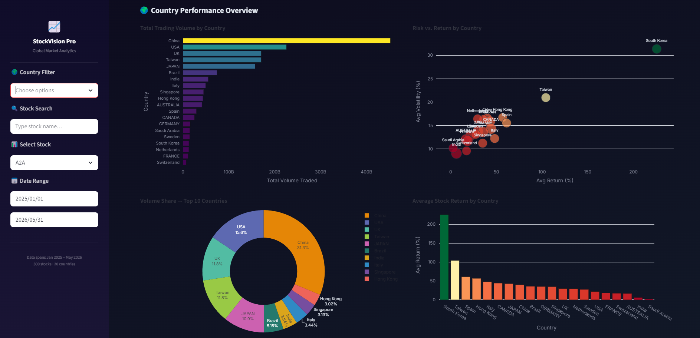
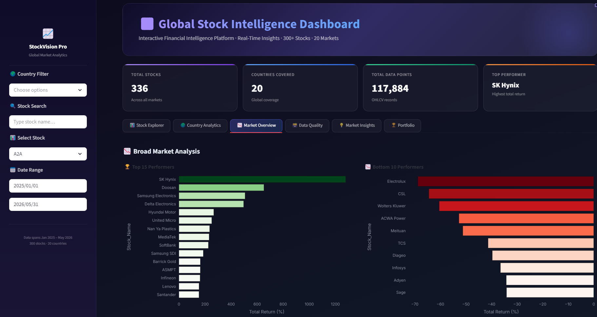

# 📈 Global Stock Intelligence Dashboard

<div align="center">

### Interactive Global Stock Analytics Platform Built with Python, Streamlit & Plotly

Analyze market movements, explore stock performance, compare global markets, and generate actionable insights through an interactive financial dashboard.

[Live Demo](https://municipal-krypton-delusion.ngrok-free.dev)


</div>

---

# 🌍 Project Overview

Financial markets generate enormous amounts of data daily, making it difficult for investors and analysts to quickly identify trends, compare markets, and understand stock behavior.

This project builds an **interactive stock intelligence platform** that transforms raw stock market data into meaningful insights through:

- Interactive analytics
- Country-wise market exploration
- Stock performance tracking
- Trend detection
- Comparative market analysis
- Storytelling dashboards

The goal is not just visualization — but helping users understand **what is happening in the market and why.**

---

# 🚀 Key Features

## 📊 Interactive Market Analytics

- Dynamic stock filtering
- Country-level exploration
- Date range filtering
- Real-time dashboard interactions
- Market storytelling approach

## 🌎 Global Market Coverage

Supports stocks across:

🇺🇸 USA  
🇮🇳 India  
🇬🇧 UK  
🇨🇦 Canada  
🇯🇵 Japan  
🇩🇪 Germany  
🇫🇷 France  
🇨🇳 China  
🇭🇰 Hong Kong  
🇸🇬 Singapore  
🇰🇷 South Korea  
🇸🇦 Saudi Arabia  
🇦🇺 Australia  
🇧🇷 Brazil  
🇹🇼 Taiwan  
🇳🇱 Netherlands  
🇨🇭 Switzerland  
🇸🇪 Sweden  
🇮🇹 Italy  
🇪🇸 Spain  

## 📈 Stock Intelligence Features

- Top gainers identification
- Biggest losers tracking
- Volume analysis
- Market trend signals
- Historical performance analysis
- OHLC analysis
- Candlestick visualization
- Trend exploration

## 🎨 Dashboard Experience

- Premium dark UI
- Interactive KPI cards
- Financial storytelling design
- Mobile responsive layout
- Smooth filtering experience
- Recruiter-friendly presentation

---

# 🧠 Business Questions Answered

This dashboard helps answer:

- Which stocks are outperforming?
- Which markets are strongest?
- Which companies are heavily traded?
- What trends exist across countries?
- Are markets bullish or bearish?
- How does one stock compare historically?

---

# 📂 Project Structure

```text
Global-Stock-Intelligence-Dashboard/
│
├── data/
│   ├── AUSTRALIA_Final.csv
│   ├── Brazil_Final.csv
│   ├── CANADA_Final.csv
│   ├── China_Final.csv
│   ├── ...
│   └── USA_Final.csv
│
├── notebook/
│   └── stocks.ipynb
│
├── app.py
├── final_data.csv
├── requirements.txt
├── README.md
│
└── screenshots
```

---

# 📊 Dataset Information

| Attribute | Details |
|----------|----------|
| Countries Covered | 20 |
| Data Source | Yahoo Finance |
| Features | OHLCV + Metadata |
| Historical Data | Multi-country |
| Format | CSV |
| Columns | Date, Open, High, Low, Close, Volume, Stock_Name, Ticker, Country |


---

# 🛠️ Tech Stack

| Technology | Purpose |
|------------|----------|
| Python | Core Development |
| Pandas | Data Processing |
| NumPy | Numerical Analysis |
| Streamlit | Dashboard Framework |
| Plotly | Interactive Visualizations |
| YFinance | Stock Data Collection |
| Jupyter Notebook | Research & EDA |
| CSS | Custom UI |

---

# 📸 Dashboard Preview

## Stock Exploration





---

## Country Performance



---

## Market Analytics




---

# ⚙️ Installation

Clone repository:

```bash
git clone https://github.com/prathmesh2507/Global-Stock-Intelligence-Dashboard.git
```

Move into folder:

```bash
cd World-Stock-Analytics
```

Install dependencies:

```bash
pip install -r requirements.txt
```

Run dashboard:

```bash
python -m streamlit run app.py
```

---

# 🔥 Future Improvements

- Portfolio Analytics
- Risk Metrics
- Sharpe Ratio
- Technical Indicators
- Forecasting Models
- AI Insights Engine
- News Sentiment Analysis
- Real-Time Data Integration
- Alert System

---

# 👨‍💻 About Me

**Prathmesh Bhoyar**

Passionate about:

- Data Analytics
- Financial Intelligence
- Machine Learning
- Interactive Dashboard Design
- Building User-Centric Analytics Products

---

# ⭐ Support

If you found this project useful:

⭐ Star the repository  
🍴 Fork the repository  
💬 Share feedback  

---

## Built to transform stock data into market intelligence.